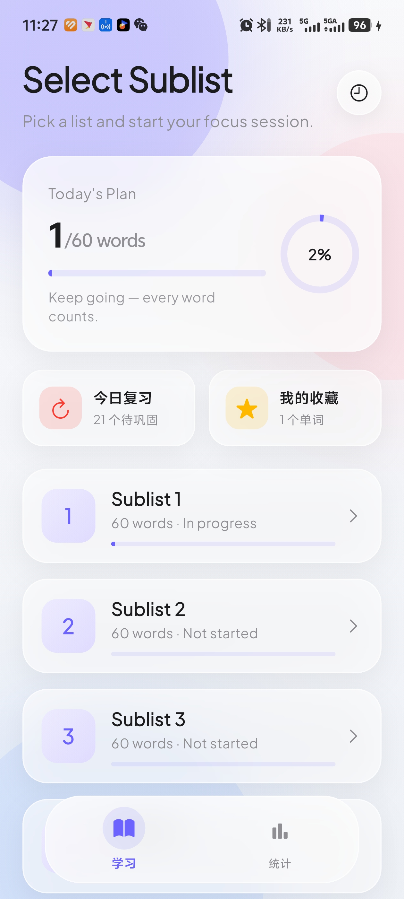
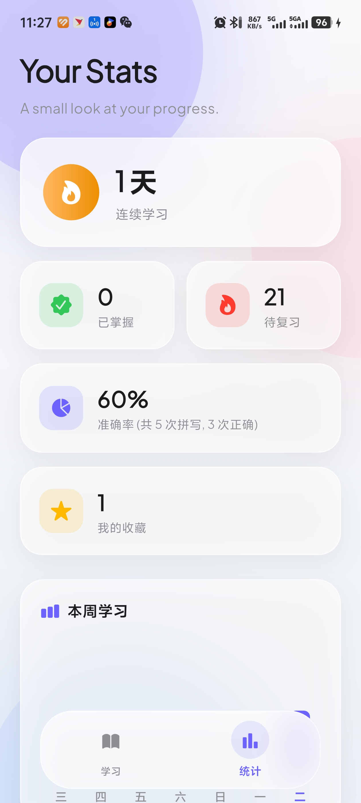

# AWL Focus

> Flutter 写的学术词汇（Academic Word List）背单词应用，主打 **Apple 风格玻璃拟态 + 专注学习体验 + SRS 间隔复习**。

<p align="center">
  
  &nbsp;&nbsp;
  
</p>

---

## ✨ 功能

### 学习模块
| 功能 | 说明 |
|---|---|
| **Sublist 分组学习** | AWL 10 个 Sublist，独立断点续学，进度自动保存 |
| **Today's Plan** | 智能检测当前进度，圆环 + 进度条直观展示 |
| **SRS 间隔复习** | 错词在 1 / 3 / 7 天后自动出现在复习列表，艾宾浩斯曲线巩固记忆 |
| **今日复习** | 所有错题集中复习，答对自动移除 |
| **我的收藏** | 星标单词独立背诵，右上角一键收藏 |
| **拼写训练** | 看中文释义 + 遮盖例句，键盘输入拼写 |
| **单词朗读** | TTS 发音，点扬声器图标即可 |

### 统计模块
| 功能 | 说明 |
|---|---|
| **连续学习天数** | 每日打卡自动记录，火焰图标激励 |
| **掌握 / 待复习** | 已掌握词数 + 待巩固错题数 |
| **准确率** | 总拼写次数与正确率统计 |
| **本周柱状图** | fl_chart 周一到周日每日学习次数 |

### 体验细节
| 细节 | 说明 |
|---|---|
| **玻璃拟态 UI** | `BackdropFilter` 真磨砂模糊，柔和阴影 + 半透明白底 |
| **Apple 风格转场** | `CupertinoPageRoute` 标准右向左滑动覆盖 |
| **闪卡切换动画** | 单词卡片弧度轨迹飞入飞出，带旋转缩放 |
| **Q弹按钮反馈** | 仿多邻国 3D 按压 + 弹性回弹（50ms / 280ms） |
| **完成庆祝** | Confetti 全屏粒子 + 脉冲光晕 + 阶梯触觉反馈 |
| **背景浮动光晕** | 三个独立漂移的 Blur Circle，不死板 |

---

## 🎨 设计语言

| Token | 值 |
|---|---|
| Primary | `#6C63FF` |
| Background | `#F8F9FB → #EEF1F6` 垂直渐变 |
| Text primary | `#1C1C1E` |
| Text secondary | `#8E8E93` |
| Success / Danger / Star | `#34C759` / `#FF3B30` / `#FFB800` |
| 字体 | Google Fonts `Plus Jakarta Sans` |
| 圆角 | 16–32px |
| 玻璃模糊 | `sigmaX/Y: 20` |
| 玻璃白底 | 60%–75% 透明度 |

---

## 🛠 技术栈

| 层 | 选型 |
|---|---|
| 框架 | Flutter (Material 3 + Cupertino) |
| 状态管理 | `ChangeNotifier` 单例 (`StudyManager`) |
| 持久化 | `shared_preferences` |
| 语音 | `flutter_tts` |
| 图表 | `fl_chart` |
| 粒子动效 | `confetti` |
| 字体 | `google_fonts` |
| 数据 | `assets/words.json` |

---

## 🚀 快速开始

```bash
git clone https://github.com/Jianyuanxi/AWL.git
cd AWL  # 或 flutter_application_1

flutter pub get
flutter run
```

需要 Flutter SDK `^3.10.1`。

### 生成 App 图标

```bash
flutter pub run flutter_launcher_icons
```

### 发布 Release APK

推送 tag 即可触发 GitHub Actions 自动构建并发布：

```bash
git tag v1.0.0
git push origin v1.0.0
```

> 首次使用需先配置签名密钥和 GitHub Secrets，详见下方「自动发布配置」。

---

## 🤖 自动发布配置

项目已配置 `.github/workflows/release.yml`，推送 `v*` tag 后自动构建签名 APK 并创建 GitHub Release。

**首次配置步骤：**

1. 运行密钥生成脚本：
```powershell
.\scripts\generate_keystore.ps1
```

2. 将脚本输出的 4 个值添加到 [GitHub Secrets](https://github.com/Jianyuanxi/AWL/settings/secrets/actions)：

| Secret 名称 | 说明 |
|---|---|
| `KEYSTORE_BASE64` | 签名密钥文件 base64 编码 |
| `KEYSTORE_PASSWORD` | Keystore 密码 |
| `KEY_ALIAS` | 密钥别名 |
| `KEY_PASSWORD` | Key 密码 |

---

## 📁 项目结构

```
lib/
  main.dart                     # 全部代码（单文件架构）
assets/
  words.json                    # AWL Sublist 数据
  screenshots/                  # 截图
  icon/2.png                    # App 图标源
.github/workflows/
  release.yml                   # GitHub Actions 自动发布
scripts/
  generate_keystore.ps1         # 签名密钥生成脚本
```

---

## 🗺 路线图

- [x] 学习统计页（连续打卡、准确率、本周柱状图）
- [x] 错题智能复习（SRS 1/3/7 天间隔）
- [x] 收藏 / 星标功能
- [x] 完成 Sublist 庆祝动效（Confetti 粒子 + 弹窗动画）
- [x] 触觉反馈
- [x] Apple 风格玻璃拟态 UI
- [x] 闪卡切换动画 + Q弹按钮
- [x] Google Fonts 字体
- [x] 背景浮动光晕
- [ ] 多种练习模式（选择题 / 听写）
- [ ] 拼写错误高亮（diff 字母级标注）
- [ ] Dark Mode

---

## 📜 License

[MIT](LICENSE)
